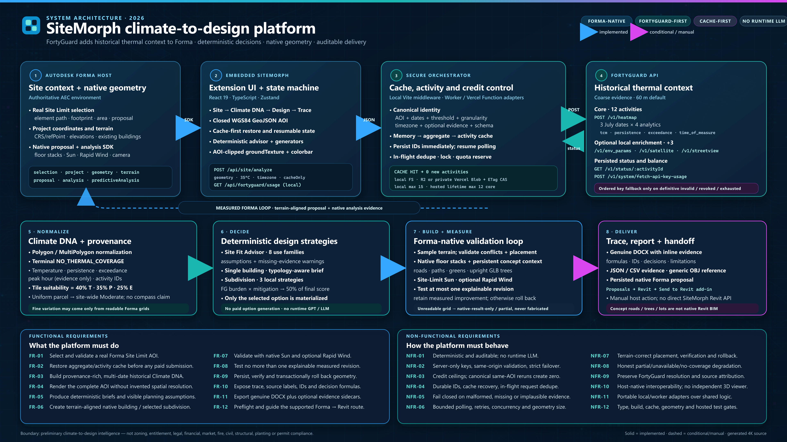

<p align="center">
  
</p>

<h1 align="center">SiteMorph</h1>

<p align="center">
  <strong>Historical climate evidence translated into native Autodesk Forma design action.</strong>
</p>

<p align="center">
  <a href="LICENSE"></a>
  
  
  
  
</p>

SiteMorph is a climate-to-design decision engine embedded in Autodesk Forma. It turns a selected Site Limit into traceable **Climate DNA**, a requirements-driven native Forma building or residential subdivision, a measured native-analysis result, and an audit-ready Word report. **FortyGuard adds historical thermal context to Forma; Forma supplies native geometry and design-performance analysis.**

The current release is an advanced prototype built with production-minded provenance, credit controls, persistent recovery, fail-closed validation, and explicit limitations. Its decision engine is deterministic and auditable—no paid GPT or other runtime LLM is required.


## Why SiteMorph

Early site design often separates historical climate evidence from the geometry that will actually be analyzed and handed downstream. SiteMorph closes that gap inside Forma:

- uses the selected Forma Site Limit as the real analysis boundary;
- preserves FortyGuard's coarse historical resolution instead of inventing parcel detail;
- translates evidence into a preliminary, editable project brief;
- creates terrain-aligned native Forma geometry—not an independent 3D viewer;
- tests at most one explainable change with native analysis and retains the better-supported result;
- records inputs, source labels, analysis identifiers, decisions, and limitations in a genuine DOCX report.

## Live workflow

1. **Select a Site Limit in Forma.** SiteMorph reads the real element path, polygon, area, project projection, and terrain context.
2. **Restore or analyze Climate DNA.** The backend checks the canonical AOI cache first. An explicitly approved local first run can request a maximum of 15 activities: 12 hot-season thermal activities plus environmental, satellite, and street-edge context. Every reopen or retry of that same canonical AOI reuses the completed result with zero new activities; a different uncached AOI requires a new explicit approval.
3. **Inspect historical behavior.** Temperature, mean persistence, mean exceedance, peak thermal time, and relative tile evidence are shown with their source and resolution.
4. **Choose a project brief or subdivision scenario.** The no-paid-API Site Fit Advisor ranks deterministic preliminary building uses, while Residential Subdivision mode accepts explicit lot, dwelling, road, open-land, parking, setback, and canopy assumptions.
5. **Generate native Forma geometry.** The single-building path creates one terrain-aligned floor stack. The subdivision path previews three local strategies, then writes only the selected option as separate terrain-aligned native floor stacks.
6. **Measure before recommending.** The single-building path can test one explainable revision with native Sun and, when available, Rapid Wind. A selected subdivision is validated once as a complete proposal with one Site-Limit Sun analysis.
7. **Report and hand off.** The persisted Forma proposal remains the Revit-transfer geometry; SiteMorph exports the evidence trail and guides the user through Forma's native Revit workflow.

### From climate brief to native Forma geometry


The current Site Fit Advisor covers eight development-use families: logistics, multifamily, office/R&D, healthcare, education, hotel, retail, and mixed use. Suggestions remain preliminary until zoning, access, utilities, market, entitlement, fire, and parking-code evidence is connected or confirmed by the user.

## Residential subdivision workflow

Residential Subdivision mode is a first-class deterministic workflow, not a handoff to a third-party geometry generator. It uses the real Forma Site Limit, saved Climate DNA, and explicit user-confirmed planning assumptions to preview three auditable strategies:

- **Compact yield** prioritizes dwelling count with the tightest spacing, no carved heat-relief corridor, and a reduced concept-canopy target.
- **Balanced neighborhood** adds perimeter spacing, a shared-green corridor, shaded pedestrian routes, and a stronger canopy response while preserving useful yield.
- **Heat-resilient neighborhood** uses the largest perimeter allowance, two heat-relief corridors, the strongest shade and dwelling-spacing mitigation, and aims to deliver the full concept-canopy target.

The generator does not infer zoning, setbacks, density, parking compliance, fire access, utilities, grading, drainage, entitlement, or planting requirements. Those values remain visible user inputs or SiteMorph assumptions with provenance and warnings.

### FortyGuard is half of every subdivision decision

Option generation reuses the already restored or completed Climate DNA. It submits **zero new paid FortyGuard activities**. The same real hot-season evidence is applied consistently to every strategy, and uniform or LOW-confidence FortyGuard data produces a site-wide response with no invented directional cool zone.

SiteMorph first calculates a four-signal FortyGuard historical burden as a weighted geometric mean:

```text
T = clamp((hot-season mean temperature °C - 20) / 25, 0, 1)
Pm = clamp(mean continuous persistence hours / 24, 0, 1)
Px = clamp(maximum continuous persistence hours / 24, 0, 1)
E = clamp(mean exceedance hours above the recorded threshold / 24, 0, 1)
FortyGuard burden B = geometricMean(T @ 35%, Pm @ 25%, Px @ 20%, E @ 20%)
```

Inputs to the logarithmic mean are bounded to `0.02–1.00` for numerical stability. Temperature, mean persistence, maximum continuous persistence, and mean exceedance are the only numerical risk inputs. The actual FortyGuard peak thermal hour is shown separately as supporting evidence and evidence-completeness context; its availability never increases or decreases heat burden.

Each plan then exposes a second multiplicative step:

```text
Mitigation multiplier M = geometricMean(
  canopy risk multiplier @ 35%,
  pedestrian-route shade multiplier @ 30%,
  open-land risk multiplier @ 20%,
  dwelling-spacing multiplier @ 15%
)

Residual heat risk = B × M
Climate resilience = 1 - residual heat risk
```

Canopy and open-land multipliers are derived from the option's delivered concept quantities against the explicit targets; shade and spacing multipliers are fixed, visible properties of the selected deterministic strategy. They are mitigation assumptions, not measured cooling performance.

The final option score keeps FortyGuard structurally central:

```text
50% FortyGuard-adjusted climate resilience
+ 20% development yield
+ 15% requested-lot match
+ 10% open-land delivery
+  5% native-Forma delivery simplicity
```

### Selected-only native delivery

All three alternatives remain local previews until the user chooses one. SiteMorph then creates only that option's dwellings with Forma's batch floor-stack API, using a separate tracked native element for every dwelling. Before accepting the run, it samples terrain beneath the footprints and verifies persisted names, SiteMorph ownership metadata, transforms, meshes, footprint containment, and terrain placement. A failed run is rolled back; earlier SiteMorph-owned roots are removed only after the replacement has persisted and passed verification.

The complete verified proposal receives one native Forma Sun analysis over the selected Site Limit. If Forma completes the job without exposing a readable ground grid, SiteMorph records `native-result-only` rather than inventing metrics. The selected plan also receives one refresh-safe virtual SiteMorph context root: roads, pedestrian paths, lot/open-space terrain shapes, and recognizable species-neutral low-poly trees at real sampled terrain elevations. The clean-room tree asset is serialized as standards-compliant glTF Y-up geometry, then SiteMorph verifies its world-space terrain base, height, canopy span, and upright orientation after Forma persists it. Those persistent custom Forma elements remain preliminary planning context and are excluded from physical analysis; the separate dwelling floor stacks remain the native design and Revit-transfer geometry. A transient ground texture is used only for labels.

The DOCX report can record the selected strategy, four weighted FortyGuard risk inputs, peak-time supporting evidence, formulas, option score, assumptions, warnings, terrain-verification counts, analysis identifier/status, and available Forma capture. The optional subdivision evidence JSON additionally preserves the tracked native element paths. For Revit, only the persisted native Forma dwelling floor stacks can follow **Proposals → Revit → Send to Revit add-in (Beta)**. SiteMorph does not claim that concept lots, roads, trees, labels, rooms, walls, roofs, openings, or custom metadata transfer as native BIM.

The deterministic generator and Forma service are covered by automated tests. A clean live multi-building Forma-to-Revit round trip has not yet been verified, so neither the product nor this README claims one.

### One measured design decision


SiteMorph does not call an intervention successful merely because an analysis finished. Implausible values, unreadable grids, or unsupported improvements are rejected or degraded explicitly; the initial geometry is restored when the tested change is not defensible.

## What is real, derived, and preliminary

| Layer | Owner | What SiteMorph uses it for |
| --- | --- | --- |
| Site Limit, projection, terrain, proposal elements | Autodesk Forma | AOI geometry, native floor stack placement, persistence, and downstream handoff |
| TCM/temperature, persistence, exceedance, peak time | FortyGuard | Multi-date historical hot-season evidence at the provider's native resolution |
| Sun and Rapid Wind grids | Autodesk Forma | Design-scale validation when the embedded SDK exposes readable results |
| Climate DNA, Site Fit ranking, subdivision ranking, program plan, decision log | SiteMorph | Deterministic translation, scoring, constraints, and audit trail |
| Subdivision lots, roads, open space, and trees | SiteMorph | Persistent virtual Forma concept elements after build; not surveyed civil geometry, planting design, verified BIM, or code compliance |
| Archived South Phoenix imagery | Third-party source evidence | Clearly dated supporting context; never represented as current-run thermal evidence |

## Key capabilities

- **Climate DNA:** multi-year hot-season evidence, explicit source labels, low-confidence handling, and clipped native-ground overlays.
- **Credit-safe analysis:** cache-first requests, persisted activity IDs, resumable polling, ordered server-only fallback keys, and a hard activity ceiling.
- **Site Fit Advisor:** input-specific deterministic briefs with visible assumptions and missing-evidence warnings.
- **FortyGuard-weighted subdivisions:** three deterministic strategies, exposed multiplicative heat-risk scoring, selected-only native dwelling delivery, refresh-safe concept roads/greens/3D trees, and zero additional paid activities for option generation.
- **Typology-aware planning:** program zones, parking, access, sheltered arrival/loading/service edges, and unallocated landscape.
- **Native Forma design loop:** terrain-safe floor stacks, footprint-conflict checks, Sun validation, optional Rapid Wind, and one measured revision.
- **Honest Revit handoff:** proposal preflight and native Forma-to-Revit guidance without calling JSON or OBJ native BIM.
- **Auditable exports:** genuine DOCX reporting plus optional CSV/JSON evidence exports.

## Architecture

<p align="center">
  <a href="docs/media/sitemorph-system-architecture-4k.png">
    
  </a>
</p>

<p align="center"><sub><strong>SiteMorph end-to-end architecture.</strong> Click the diagram for the full 3840 × 2160 version. The editable vector source is available at <a href="docs/media/sitemorph-system-architecture.svg">docs/media/sitemorph-system-architecture.svg</a>.</sub></p>

The diagram distinguishes implemented solid routes from conditional or user-driven dashed routes. FortyGuard remains the historical-evidence system; Autodesk Forma remains authoritative for site geometry, terrain, native proposal elements and design-scale analysis; SiteMorph owns orchestration, deterministic decisions, validation and traceability.

### Runtime routes

| Boundary | Method and route | Purpose |
| --- | --- | --- |
| Embedded panel → SiteMorph | `POST /api/site/analyze` | Cache-first restore or analysis for a GeoJSON Site Limit, 35 °C threshold, site timezone and `cacheOnly` state |
| Embedded panel → local SiteMorph | `GET /api/fortyguard/usage` | Retrieves or restores a dated server-side credit snapshot; deliberately disabled on the public hosted worker |
| SiteMorph → FortyGuard | `POST /v1/heatmap` | Creates one core activity for each date and analytic type: `tcm`, `persistence`, `exceedance`, or `time_of_measure` |
| SiteMorph → FortyGuard | `GET /v1/status/:activityId` | Resumes and polls the exact persisted activity ID without resubmitting it |
| SiteMorph → FortyGuard | `POST /v1/env_params`, `/v1/satellite`, `/v1/streetview` | Optional complete-local-run context; three additional activities when explicitly enabled |
| SiteMorph → FortyGuard | `POST /v1/system/fetch-api-key-usage` | Server-only usage lookup; the browser never receives an API key |

### Functional and non-functional requirements

| Type | Requirement | Implemented behavior |
| --- | --- | --- |
| Functional | Real Forma AOI | Accepts a selected Site Limit element path, validates its footprint and converts project coordinates into a closed WGS84 Polygon |
| Functional | Historical Climate DNA | Restores or creates multi-date temperature, persistence, exceedance and peak-time evidence with source, activity-ID, timezone and resolution provenance |
| Functional | Honest spatial display | Clips the ground texture to the complete Site Limit, extends only the nearest real edge value and never invents parcel-scale variation |
| Functional | Deterministic design | Produces preliminary Site Fit briefs, a typology-aware single-building loop, or three auditable subdivision strategies with explicit assumptions and formulas |
| Functional | Forma-native delivery | Creates terrain-aligned native floor stacks, materializes only the selected subdivision, verifies placement and persists preliminary concept context separately |
| Functional | Measured decision | Runs native Site-Limit Sun and optional Rapid Wind, tests at most one explainable revision and retains it only when readable metrics support improvement |
| Functional | Trace and handoff | Exports genuine DOCX and evidence sidecars, preflights the persisted proposal and guides the supported Forma → Revit add-in workflow |
| Non-functional | Deterministic and auditable | Requires no runtime LLM; formulas, provenance, IDs, timestamps, decisions and limitations remain inspectable |
| Non-functional | Secure and credit-safe | Keeps keys server-side, uses strict ordered failover, enforces activity ceilings and reuses the same canonical AOI with zero new activities |
| Non-functional | Durable and recoverable | Persists activity IDs immediately, resumes polling, coalesces in-flight requests and survives process restarts through local or hosted storage |
| Non-functional | Fail-closed integrity | Rejects malformed geometry, empty thermal coverage, implausible Sun values, unreadable grids and displaced geometry instead of manufacturing a recommendation |
| Non-functional | Bounded operation | Caps polling, retries, concurrency, request size, terrain sampling and geometry work; hosted analysis also uses origin, lock and quota guards |
| Non-functional | Host-native interoperability | Treats Forma as the geometry/analysis authority, keeps Revit transfer user-driven and never claims concept overlays or JSON are native BIM |

Important implementation seams:

- `src/services/forma.service.ts` resolves the selected Site Limit and converts project geometry to closed WGS84 GeoJSON.
- `server/fortyguard.ts` and the hosted worker implement cache-first FortyGuard orchestration with persistent quota and activity guards.
- `src/services/overlay.service.ts` clips historical cells to the AOI and uses `Forma.terrain.groundTexture` while leaving buildings in their native appearance.
- `src/services/forma-design.service.ts` creates and validates the native floor stack, runs Forma analysis, and retains the measured result.
- `src/utils/subdivision-layout.ts` generates and ranks the three deterministic subdivision strategies from the Site Limit, explicit assumptions, and saved FortyGuard evidence.
- `src/services/forma-subdivision.service.ts` persists only the selected dwellings, verifies every terrain-aligned native floor stack, and runs one complete-proposal Site-Limit Sun analysis.
- `src/services/forma-subdivision-context.service.ts` persists one virtual planning root with typed terrain shapes and a reusable clean-room GLB tree model instanced at sampled terrain elevations.
- `src/services/forma-subdivision-overlay.service.ts` keeps the pre-build preview and post-build labels transient; it is no longer the persistence source for roads or trees.
- `src/services/forma-climate-response.service.ts` keeps historical burden and native Forma grids separately attributable before combining available inputs.
- `src/utils/site-report.ts` builds the genuine Word deliverable and embeds available design/evidence imagery.

## Getting started

### Prerequisites

- Node.js 22 or newer
- npm
- an Autodesk Forma project with embedded-view extension access
- a FortyGuard key only when an uncached live analysis has been explicitly approved

### Install

```powershell
git clone https://github.com/Vetri1706/SiteMorph.git
Set-Location SiteMorph
npm ci
Copy-Item .env.example .env
npm run dev
```

The development server listens on `http://localhost:4173/`. Live Forma SDK behavior requires the page to run inside the Forma extension iframe; an ordinary browser tab cannot supply a real Site Limit or native analysis context.

### Register the local Forma panel

Use the following button configuration in the Forma extension settings:

```yaml
- actions:
    click:
      type: OPEN_FLOATING_PANEL
      preferredSize:
        width: 420
        height: 760
      url: http://localhost:4173/
  label: Open SiteMorph
```

The same URL can be registered as a left-menu embedded view when that placement is preferable.

## Configuration and security

Start from `.env.example`. Never expose a FortyGuard key, Autodesk client secret, or backend credential through a `VITE_*` variable.

| Variable | Scope | Purpose |
| --- | --- | --- |
| `VITE_SITEMORPH_BACKEND_URL` | Browser | Relative or trusted SiteMorph backend URL |
| `VITE_FORTYGUARD_PAID_ANALYSIS` | Browser | Shows the explicitly confirmed uncached-analysis action locally; the server ceiling remains authoritative |
| `VITE_FORTYGUARD_OPTIONAL_EVIDENCE` | Browser | Shows the local enrichment workflow only when the server is configured to supply it |
| `FORTYGUARD_API_KEY` | Server only | Primary FortyGuard credential |
| `FORTYGUARD_FALLBACK_API_KEYS` | Server only | Ordered fallback credentials used only after definitive invalid/exhausted responses |
| `FORTYGUARD_API_URL` | Server only | FortyGuard API base URL; defaults to `https://api.fortyguard.com/v1` |
| `FORTYGUARD_ANALYSIS_DATES` | Server only | Representative hot-season dates included in the canonical cache key |
| `FORTYGUARD_GRANULARITY` | Server only | Requested historical evidence resolution |
| `FORTYGUARD_MAX_NEW_ACTIVITIES` | Server only | Hard ceiling for newly submitted activities; Safe mode defaults to `0` |
| `FORTYGUARD_INCLUDE_OPTIONAL_EVIDENCE` | Server only | Keeps enrichment disabled unless explicitly enabled |
| `FORTYGUARD_MAX_POLL_ATTEMPTS` | Server only | Bounded number of saved activity-status checks for one request |
| `FORTYGUARD_POLL_INTERVAL_MS` | Server only | Delay between provider status checks |
| `FORTYGUARD_CACHE_VERSION` | Server only | Intentional cache-schema/refresh boundary |
| `SITEMORPH_HOSTED_ACTIVITY_BUDGET` | Hosted server only | Persistent public lifetime activity ceiling; defaults to the guarded 12-core limit |
| `BLOB_STORE_ID` | Vercel-managed server only | Private Vercel Blob store used for AOI results, activity IDs, locks and the lifetime quota; injected when the store is connected |

Local aggregate responses are saved under `.sitemorph-cache/fortyguard/`, per-activity IDs and statuses under `.sitemorph-cache/fortyguard-activities/`, and the dated usage snapshot at `.sitemorph-cache/fortyguard-usage.json`. Equivalent polygon rotation or winding produces the same canonical AOI key. Ambiguous network failures never rotate credentials or silently resubmit paid work.

For an explicitly approved complete local first run, set the server ceiling to `15`, enable both optional-evidence flags, and keep the three representative hot-season dates. The public hosted workflow intentionally remains capped at 12 core activities with enrichment disabled. Fallback keys stay server-side, retain their declared order, and are attempted only after a definitive exhausted-credit or invalid/revoked-credential response.

## Verification

```powershell
npm run typecheck
npm run test:ranking
npm run test:design
npm run test:report
npm run test:cache
npm run test:hybrid
npm run test:revit
npm run test:vercel
npm run build
npm run test:sites
```

The production build must emit:

```text
dist/client/index.html
dist/server/index.js
dist/.openai/hosting.json
```

## Deployment

SiteMorph's production target is Vercel. `vercel.json` publishes `dist/client` as the Vite application and deploys `/api/site/analyze` plus the deliberately disabled public usage route as Node.js Functions. A connected private Vercel Blob store supplies durable object storage and ETag compare-and-set behavior for the AOI cache, saved activity IDs, in-flight locks and the one-time hosted quota reservation.

Production credentials are scoped to Vercel Production only. `FORTYGUARD_API_KEY` and the ordered comma-separated `FORTYGUARD_FALLBACK_API_KEYS` remain encrypted server variables; preview deployments receive no FortyGuard credentials. The production browser build enables the explicit uncached-analysis confirmation while enrichment stays disabled, and `SITEMORPH_HOSTED_ACTIVITY_BUDGET=12` remains the authoritative lifetime ceiling.

`npm run build` also preserves the Sites-compatible package. Any additional host must provide all of the following:

- HTTPS static delivery for `dist/client`;
- a server-side `/api/site/analyze` runtime;
- persistent storage for the AOI cache, activity state, and lifetime hosted allowance;
- server-only secrets;
- origin validation and fail-closed quota reservation.

A static-only deployment can show the interface but cannot safely provide uncached live FortyGuard analysis.

## Revit handoff

SiteMorph persists and verifies its native Forma proposal element or selected subdivision dwelling elements. The user then completes the supported host workflow through **Proposals → Revit → Send to Revit add-in (Beta)**. The public embedded-view SDK does not expose a trigger for that host menu.

The transferable artifacts are the native Forma mass/floor stack and, for a materialized subdivision, the separate native Forma dwelling floor stacks. SiteMorph's program labels remain report/evidence data. Built subdivisions also contain persistent virtual road/green terrain shapes and low-poly tree instances inside Forma, but SiteMorph does not claim that they become Revit Roads, Toposolids, Planting families, Rooms, or parameters. JSON and OBJ exports are optional audit/reference files, not BIM synchronization. A clean multi-building subdivision round trip remains explicitly unverified.

## Known limitations

- Site Fit results are not zoning, entitlement, legal, financial, market, fire, parking-code, civil, or structural advice.
- FortyGuard historical layers may be spatially uniform at 60 m resolution; SiteMorph reports low zoning confidence instead of inventing a preferred direction.
- FortyGuard currently documents United States regional coverage. If completed saved activities return an empty polygon FeatureCollection, SiteMorph records a terminal no-coverage result, preserves the activity IDs, skips dependent metrics, and does not resubmit or invent Climate DNA.
- Forma may complete an analysis without exposing a readable ground grid. SiteMorph records native-result-only or partial status rather than fabricating metrics.
- The Compare tab remains a precomputed demo workflow. Residential Subdivision mode separately generates three deterministic local previews and writes only the selected option; it does not imply three live Forma analyses.
- The generated object is concept-stage mass/floor geometry, not detailed walls, roofs, openings, systems, or construction documentation.
- Built subdivision lot lines, roads, paths, open space, and trees are persistent virtual concept elements, not surveyed alignments, grading, code-compliant access, species selections, planting design, or validated BIM. Before build, they are local previews only.
- Revit transfer is completed through Autodesk's add-in UI; SiteMorph cannot invoke it programmatically.
- There is no runtime GPT/LLM dependency. `AGENTS.md` guides coding agents working on this repository and is not application logic.

## Project structure

```text
src/                 React extension UI, Forma services, decision logic
server/              Local FortyGuard orchestration and cache logic
worker/              Hosted runtime and persistent activity guards
tests/               Ranking, design, cache, report, Revit and hosted API tests
public/              Canonical branding and explicitly labeled evidence assets
docs/media/          4K architecture source/render and real project workflow animations
scripts/             Sites build and packaging helpers
.openai/hosting.json Sites hosting contract
```

## License

SiteMorph-authored source code and documentation are available under the [MIT License](LICENSE). Copyright © 2026 Vetri Kalanjiyam.

Third-party product screenshots, trademarks, basemap attribution, archived evidence, and provider output remain subject to their respective owners' terms and are not relicensed by MIT. See [Third-Party Notices](THIRD_PARTY_NOTICES.md).

## Acknowledgements

- **Autodesk Forma** supplies the native site, geometry, proposal, Sun, Wind, and Revit-handoff environment.
- **FortyGuard** supplies historical thermal context used by Climate DNA.
- Basemap and captured source attribution remains visible in the relevant evidence and screenshots.

SiteMorph is an independent prototype and is not endorsed by Autodesk or FortyGuard. Autodesk, Forma, Revit, FortyGuard, and other names and marks belong to their respective owners.
