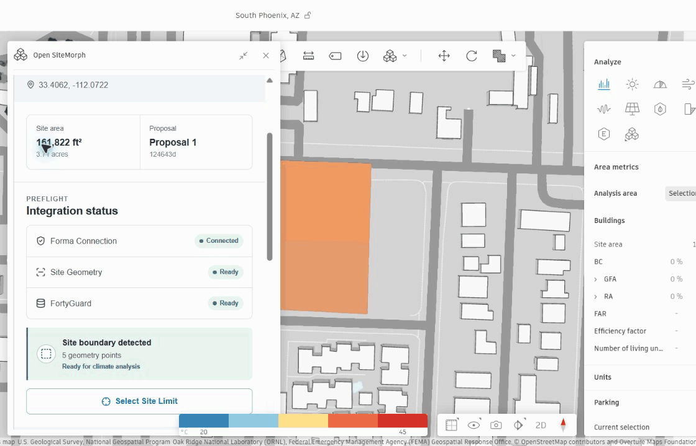
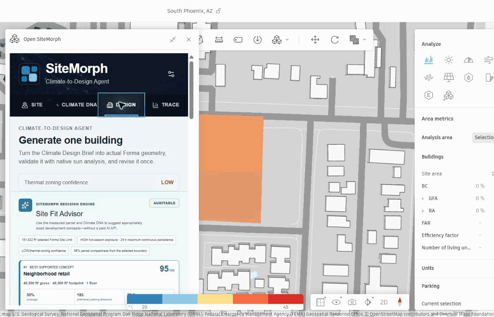
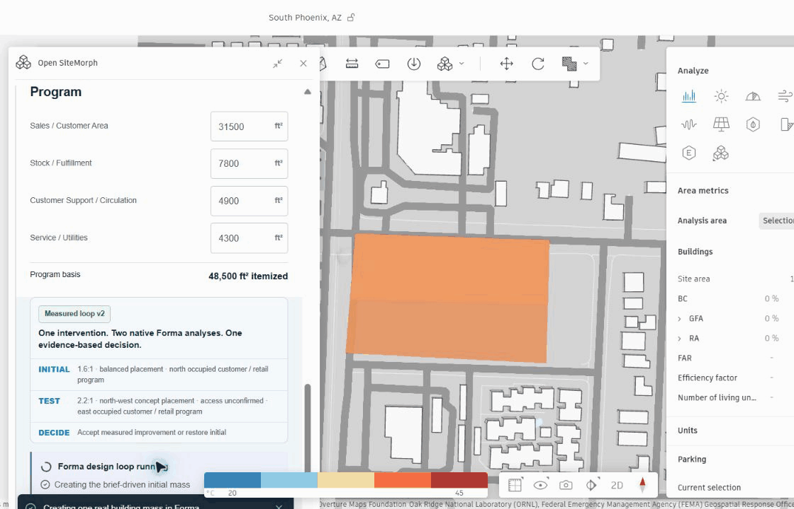
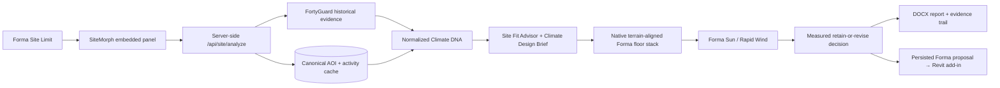

<p align="center">
  
</p>

<h1 align="center">SiteMorph</h1>

<p align="center">
  <strong>Historical climate evidence translated into native Autodesk Forma design action.</strong>
</p>

<p align="center">
  <a href="LICENSE"></a>
  
  
  
  
</p>

SiteMorph is a climate-to-design decision engine embedded in Autodesk Forma. It turns a selected Site Limit into traceable **Climate DNA**, a requirements-driven native Forma floor stack, one measured design revision, and an audit-ready Word report. **FortyGuard adds historical thermal context to Forma; Forma supplies native geometry and design-performance analysis.**

The current release is an advanced prototype built with production-minded provenance, credit controls, persistent recovery, fail-closed validation, and explicit limitations. Its decision engine is deterministic and auditable—no paid GPT or other runtime LLM is required.



## Why SiteMorph

Early site design often separates historical climate evidence from the geometry that will actually be analyzed and handed downstream. SiteMorph closes that gap inside Forma:

- uses the selected Forma Site Limit as the real analysis boundary;
- preserves FortyGuard's coarse historical resolution instead of inventing parcel detail;
- translates evidence into a preliminary, editable project brief;
- creates terrain-aligned native Forma geometry—not an independent 3D viewer;
- tests at most one explainable change with native analysis and retains the better-supported result;
- records inputs, source labels, analysis identifiers, decisions, and limitations in a genuine DOCX report.

## Live workflow

1. **Select a Site Limit in Forma.** SiteMorph reads the real element path, polygon, area, project projection, and terrain context.
2. **Restore or analyze Climate DNA.** The backend checks the canonical AOI cache first, then requests only explicitly approved FortyGuard thermal activities.
3. **Inspect historical behavior.** Temperature, mean persistence, mean exceedance, peak thermal time, and relative tile evidence are shown with their source and resolution.
4. **Choose a project brief.** The no-paid-API Site Fit Advisor ranks deterministic preliminary options, or the user enters requirements manually.
5. **Generate one native building.** SiteMorph creates a terrain-aligned `Forma.elements.floorStack`, avoids readable nearby building footprints, and adds a typology-aware program/site-plan overlay.
6. **Measure before recommending.** Forma runs native Sun analysis and, when available, Rapid Wind. SiteMorph may test one revision and accepts it only when the returned metrics support it.
7. **Report and hand off.** The persisted Forma proposal remains the Revit-transfer geometry; SiteMorph exports the evidence trail and guides the user through Forma's native Revit workflow.

### From climate brief to native Forma geometry



The current Site Fit Advisor covers eight development-use families: logistics, multifamily, office/R&D, healthcare, education, hotel, retail, and mixed use. Suggestions remain preliminary until zoning, access, utilities, market, entitlement, fire, and parking-code evidence is connected or confirmed by the user.

### One measured design decision



SiteMorph does not call an intervention successful merely because an analysis finished. Implausible values, unreadable grids, or unsupported improvements are rejected or degraded explicitly; the initial geometry is restored when the tested change is not defensible.

## What is real, derived, and preliminary

| Layer | Owner | What SiteMorph uses it for |
| --- | --- | --- |
| Site Limit, projection, terrain, proposal elements | Autodesk Forma | AOI geometry, native floor stack placement, persistence, and downstream handoff |
| TCM/temperature, persistence, exceedance, peak time | FortyGuard | Multi-date historical hot-season evidence at the provider's native resolution |
| Sun and Rapid Wind grids | Autodesk Forma | Design-scale validation when the embedded SDK exposes readable results |
| Climate DNA, Site Fit ranking, program plan, decision log | SiteMorph | Deterministic translation, scoring, constraints, and audit trail |
| Archived South Phoenix imagery | Third-party source evidence | Clearly dated supporting context; never represented as current-run thermal evidence |

## Key capabilities

- **Climate DNA:** multi-year hot-season evidence, explicit source labels, low-confidence handling, and clipped native-ground overlays.
- **Credit-safe analysis:** cache-first requests, persisted activity IDs, resumable polling, ordered server-only fallback keys, and a hard activity ceiling.
- **Site Fit Advisor:** input-specific deterministic briefs with visible assumptions and missing-evidence warnings.
- **Typology-aware planning:** program zones, parking, access, sheltered arrival/loading/service edges, and unallocated landscape.
- **Native Forma design loop:** terrain-safe floor stacks, footprint-conflict checks, Sun validation, optional Rapid Wind, and one measured revision.
- **Honest Revit handoff:** proposal preflight and native Forma-to-Revit guidance without calling JSON or OBJ native BIM.
- **Auditable exports:** genuine DOCX reporting plus optional CSV/JSON evidence exports.

## Architecture



Important implementation seams:

- `src/services/forma.service.ts` resolves the selected Site Limit and converts project geometry to closed WGS84 GeoJSON.
- `server/fortyguard.ts` and the hosted worker implement cache-first FortyGuard orchestration with persistent quota and activity guards.
- `src/services/overlay.service.ts` clips historical cells to the AOI and uses `Forma.terrain.groundTexture` while leaving buildings in their native appearance.
- `src/services/forma-design.service.ts` creates and validates the native floor stack, runs Forma analysis, and retains the measured result.
- `src/services/forma-climate-response.service.ts` keeps historical burden and native Forma grids separately attributable before combining available inputs.
- `src/utils/site-report.ts` builds the genuine Word deliverable and embeds available design/evidence imagery.

## Getting started

### Prerequisites

- Node.js 22 or newer
- npm
- an Autodesk Forma project with embedded-view extension access
- a FortyGuard key only when an uncached live analysis has been explicitly approved

### Install

```powershell
git clone https://github.com/Vetri1706/SiteMorph.git
Set-Location SiteMorph
npm ci
Copy-Item .env.example .env
npm run dev
```

The development server listens on `http://localhost:4173/`. Live Forma SDK behavior requires the page to run inside the Forma extension iframe; an ordinary browser tab cannot supply a real Site Limit or native analysis context.

### Register the local Forma panel

Use the following button configuration in the Forma extension settings:

```yaml
- actions:
    click:
      type: OPEN_FLOATING_PANEL
      preferredSize:
        width: 420
        height: 760
      url: http://localhost:4173/
  label: Open SiteMorph
```

The same URL can be registered as a left-menu embedded view when that placement is preferable.

## Configuration and security

Start from `.env.example`. Never expose a FortyGuard key, Autodesk client secret, or backend credential through a `VITE_*` variable.

| Variable | Scope | Purpose |
| --- | --- | --- |
| `VITE_MOCK_MODE` | Browser | Enables explicitly labeled demo content when `true` |
| `VITE_SITEMORPH_BACKEND_URL` | Browser | Relative or trusted SiteMorph backend URL |
| `FORTYGUARD_API_KEY` | Server only | Primary FortyGuard credential |
| `FORTYGUARD_FALLBACK_API_KEYS` | Server only | Ordered fallback credentials used only after definitive invalid/exhausted responses |
| `FORTYGUARD_ANALYSIS_DATES` | Server only | Representative hot-season dates included in the canonical cache key |
| `FORTYGUARD_GRANULARITY` | Server only | Requested historical evidence resolution |
| `FORTYGUARD_MAX_NEW_ACTIVITIES` | Server only | Hard ceiling for newly submitted activities; Safe mode defaults to `0` |
| `FORTYGUARD_INCLUDE_OPTIONAL_EVIDENCE` | Server only | Keeps enrichment disabled unless explicitly enabled |
| `FORTYGUARD_CACHE_VERSION` | Server only | Intentional cache-schema/refresh boundary |

Completed responses and submitted activity IDs are saved under `.sitemorph-cache/fortyguard/`. Equivalent polygon rotation or winding produces the same canonical AOI key. Ambiguous network failures never rotate credentials or silently resubmit paid work.

## Verification

```powershell
npm run typecheck
npm run test:ranking
npm run test:design
npm run test:report
npm run test:cache
npm run test:hybrid
npm run test:revit
npm run build
npm run test:sites
```

The production build must emit:

```text
dist/client/index.html
dist/server/index.js
dist/.openai/hosting.json
```

## Deployment

`npm run build` packages the client and server worker used by the current Sites-compatible deployment. Any other host must provide all of the following:

- HTTPS static delivery for `dist/client`;
- a server-side `/api/site/analyze` runtime;
- persistent storage for the AOI cache, activity state, and lifetime hosted allowance;
- server-only secrets;
- origin validation and fail-closed quota reservation.

A static-only deployment can show the interface but cannot safely provide uncached live FortyGuard analysis.

## Revit handoff

SiteMorph persists and verifies its native Forma proposal element. The user then completes the supported host workflow through **Proposals → Revit → Send to Revit add-in (Beta)**. The public embedded-view SDK does not expose a trigger for that host menu.

The transferred artifact is the native Forma mass/floor stack and its Forma building reference. SiteMorph's detailed program labels remain report/evidence data; they are not represented as native Revit Rooms. JSON and OBJ exports are optional audit/reference files, not BIM synchronization.

## Known limitations

- Site Fit results are not zoning, entitlement, legal, financial, market, fire, parking-code, civil, or structural advice.
- FortyGuard historical layers may be spatially uniform at 60 m resolution; SiteMorph reports low zoning confidence instead of inventing a preferred direction.
- Forma may complete an analysis without exposing a readable ground grid. SiteMorph records native-result-only or partial status rather than fabricating metrics.
- Compare and multi-candidate content remain precomputed demo workflows; the live path generates one requirements-driven building.
- The generated object is concept-stage mass/floor geometry, not detailed walls, roofs, openings, systems, or construction documentation.
- Revit transfer is completed through Autodesk's add-in UI; SiteMorph cannot invoke it programmatically.
- There is no runtime GPT/LLM dependency. `AGENTS.md` guides coding agents working on this repository and is not application logic.

## Project structure

```text
src/                 React extension UI, Forma services, decision logic
server/              Local FortyGuard orchestration and cache logic
worker/              Hosted runtime and persistent activity guards
tests/               Ranking, design, cache, report, Revit and hosted API tests
public/              Canonical branding and explicitly labeled evidence assets
docs/media/          Real project workflow animations used by this README
scripts/             Sites build and packaging helpers
.openai/hosting.json Sites hosting contract
```

## License

SiteMorph-authored source code and documentation are available under the [MIT License](LICENSE). Copyright © 2026 Vetri Kalanjiyam.

Third-party product screenshots, trademarks, basemap attribution, archived evidence, and provider output remain subject to their respective owners' terms and are not relicensed by MIT. See [Third-Party Notices](THIRD_PARTY_NOTICES.md).

## Acknowledgements

- **Autodesk Forma** supplies the native site, geometry, proposal, Sun, Wind, and Revit-handoff environment.
- **FortyGuard** supplies historical thermal context used by Climate DNA.
- Basemap and captured source attribution remains visible in the relevant evidence and screenshots.

SiteMorph is an independent prototype and is not endorsed by Autodesk or FortyGuard. Autodesk, Forma, Revit, FortyGuard, and other names and marks belong to their respective owners.
